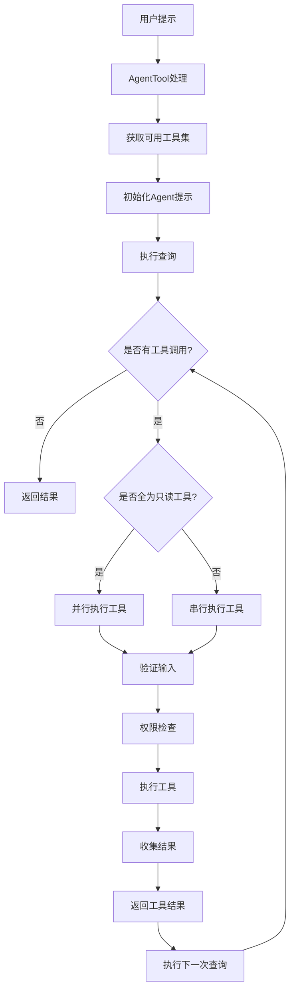

# System Patterns

## System Architecture

*   **Monolithic CLI Application:** The application is structured as a single command-line tool (`kode`).
*   **Component-Based UI:** Uses Ink (React for CLIs) to build interactive terminal interfaces (`src/components/`, `src/screens/`).
*   **Command Pattern:** Uses `commander` to define and handle different CLI commands (`src/commands/`).
*   **Modular Structure:** Code is organized into directories based on functionality (e.g., `commands`, `components`, `services`, `tools`, `utils`).
*   **MCP Integration:** Can operate as a Model Context Protocol (MCP) server (`src/entrypoints/mcp.ts`), allowing other tools (like Claude Desktop) to use its capabilities.

## Key Technical Decisions

*   **Node.js + TypeScript:** Provides a robust platform for CLI development with strong typing.
*   **Ink (React for CLI):** Enables building rich, interactive terminal UIs.
*   **Commander.js:** Standard library for parsing command-line arguments and defining commands.
*   **OpenAI-style API Compatibility:** Allows flexibility in choosing AI models.
*   **MCP Support:** Extends usability by allowing integration with other MCP-compatible applications.
*   **pnpm:** Chosen package manager.

## Design Patterns in Use

*   **Command Pattern:** Implemented via `commander` in `src/commands/`. Each command encapsulates a specific action.
*   **Component Pattern:** Used extensively with Ink/React in `src/components/` and `src/screens/` for UI elements.
*   **Service Locator/Dependency Injection (Implicit):** Services like AI clients (`src/services/claude.ts`, `src/services/openai.ts`), configuration (`src/utils/config.ts`), and state management (`src/utils/state.ts`) are likely imported and used across different modules.
*   **Strategy Pattern (Potential):** Different AI models or tools (`src/tools/`) might be treated as interchangeable strategies.

## Agent 架构与工具调用机制

### Agent Prompt 设计模式

*   **结构化 Prompt 系统:** Agent 提示由两个主要部分组成 - 简洁的任务描述和环境上下文信息。
*   **简洁交互风格:** 严格要求简短、直接的回答，适合命令行界面展示，避免不必要的引言和解释。
*   **输出格式规范化:** 在 `src/constants/prompts.ts` 中定义了严格的输出格式要求，如使用绝对路径和在合适时共享代码片段。

### 工具调用架构

*   **工具可用性管理:** 通过 `getAgentTools` 函数（`src/tools/AgentTool/prompt.ts`）动态确定 Agent 可访问的工具集合。
*   **并行/串行执行策略:**
    * 并行执行：对只读工具使用 `runToolsConcurrently` 函数，最多支持 10 个并发工具调用
    * 串行执行：对非只读工具使用 `runToolsSerially` 函数，确保安全的顺序执行
*   **权限管理系统:** 实现了严格的权限检查机制，限制 Agent 对敏感工具（如文件修改工具）的访问。
*   **防递归机制:** 防止 Agent 递归调用自身，避免潜在的无限循环。

### 工具执行流程

1. **工具选择:** Agent 基于任务需求选择合适的工具
2. **权限检查:** 系统验证 Agent 是否有权限使用所选工具
3. **输入验证:** 使用 zod schema 验证工具输入格式
4. **输入规范化:** 通过 `normalizeToolInput` 对特定工具输入进行标准化处理
5. **工具执行:** 根据工具类型选择并行或串行执行
6. **结果处理:** 收集工具执行结果并返回给调用方

### 核心工具调用代码路径

*   **Agent 工具定义:** `src/tools/AgentTool/AgentTool.tsx` 和 `src/tools/AgentTool/prompt.ts`
*   **工具注册管理:** `src/tools.ts` 包含所有可用工具的注册和检索逻辑
*   **工具调用执行:** `src/query.ts` 实现了工具调用的核心执行逻辑
*   **提示模板定义:** `src/constants/prompts.ts` 定义了 Agent 使用的提示模板

## Component Relationships

```mermaid
graph TD
    CLI[cli.tsx Entrypoint] --> Commander(Commander.js)
    Commander --> Commands(src/commands/*)
    Commands --> Screens(src/screens/*)
    Commands --> Services(src/services/*)
    Commands --> Tools(src/tools/*)
    Commands --> Utils(src/utils/*)

    Screens --> Components(src/components/*)
    Components --> Hooks(src/hooks/*)
    Components --> Utils

    Services --> AI_APIs(External AI APIs)
    Services --> MCP_SDK(@modelcontextprotocol/sdk)

    Tools --> Services
    Tools --> Utils

    MCP[mcp.ts Entrypoint] --> MCP_SDK
    MCP_SDK --> Tools
    MCP_SDK --> Services

    subgraph UI
        direction TB
        Screens
        Components
        Hooks[src/hooks/*]
    end

    subgraph CoreLogic
        direction TB
        Commands
        Services
        Tools
        Utils
    end

    subgraph Entrypoints
        direction TB
        CLI
        MCP
    end

    Entrypoints --> CoreLogic
    CoreLogic --> UI
    CoreLogic --> AI_APIs
```

## 工具调用流程图



## Critical Implementation Paths

*   **User Interaction:** `cli.tsx` -> `Ink App` -> `Screens/Components` -> `PromptInput` -> User Input.
*   **Command Execution:** User Input -> `Commander` -> Specific Command (`src/commands/`) -> Relevant Services/Tools/Utils.
*   **AI Interaction:** Command -> Service (`claude.ts`/`openai.ts`) -> External API Call -> Response -> Service -> Command -> UI Update.
*   **File Operations:** Command -> Tool (`FileEditTool`, `FileReadTool`, etc.) -> `src/utils/file.ts` -> Filesystem.
*   **MCP Server:** External Request -> `mcp.ts` -> `MCP SDK` -> Tool Execution -> Response.
*   **工具调用路径:** User Input -> `query.ts` -> `Tools` -> `checkPermissionsAndCallTool` -> `Tool.call()` -> Results -> Response Processing.
